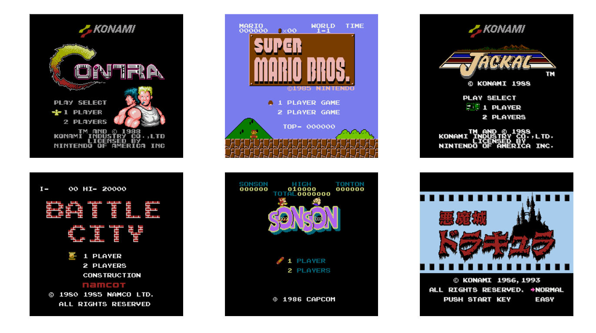

# Nes Emulator

## 简介

这是一个完全基于c++的nes模拟器，通过用代码模拟硬件的工作原理来模拟一个nes。

带目前位置，这个模拟器已经可以运行 mapper000 和 mapper002 的游戏了（ 但是没有声音 ）。

## 实现原理

博客和代码同步更新 :D

- [从零开始的nes 模拟器-CPU](https://www.cnblogs.com/chzarles/articles/15816145.html)

- [从零开始的nes模拟器-卡带和Mapper](https://www.cnblogs.com/chzarles/articles/15826933.html)

- [从零开始的nes模拟器-PPU简介](https://www.cnblogs.com/chzarles/articles/15856663.html)

- [从零开始的nes模拟器-PPU渲染背景](https://www.cnblogs.com/chzarles/articles/15865950.html)

- [从零开始的nes模拟器-PPU渲染精灵](https://www.cnblogs.com/chzarles/articles/15896651.html)

- [从零开始的nes模拟器- 总线](https://www.cnblogs.com/chzarles/articles/15896662.html)

- [从零开始的nes模拟器- 控制设备](https://www.cnblogs.com/chzarles/articles/15896677.html)

- [从零开始的nes模拟器- Mapper适配 ](https://www.cnblogs.com/chzarles/articles/15896692.html)

  

## 待办

- [ ] 适配Mapper003
- [ ] 适配Mapper001
- [ ] 适配Mapper004
- [ ] 适配Mapper066
- [ ] 移植到qt
- [ ] 添加音频处理器，增加声音
- [ ] 添加存档功能

## 效果

## 鸣谢

- [Javidx9](https://github.com/OneLoneCoder)